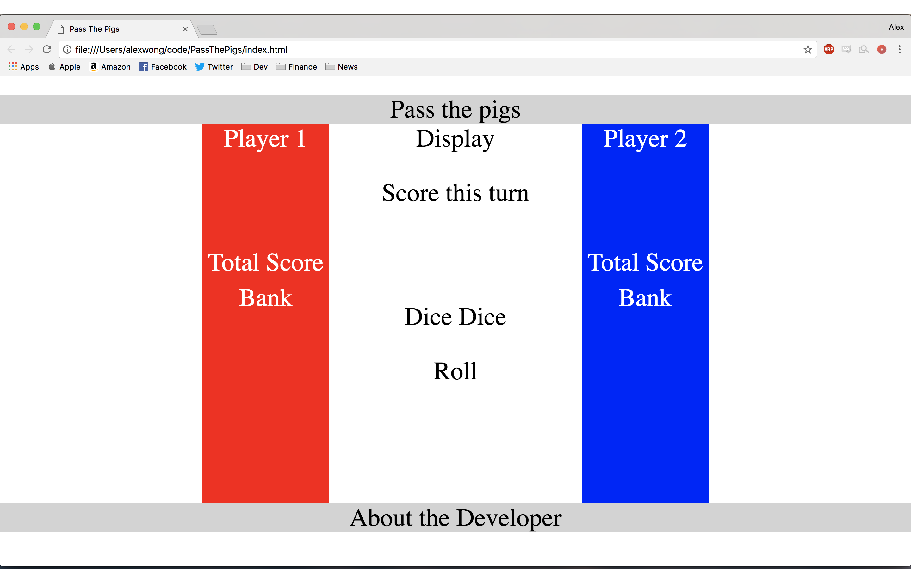
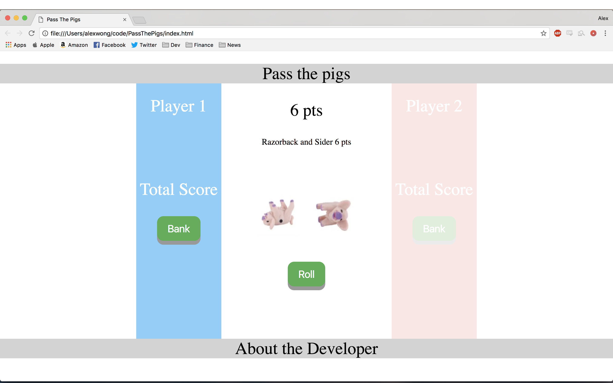
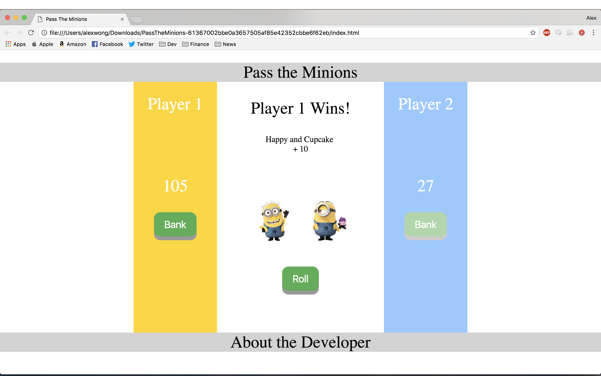
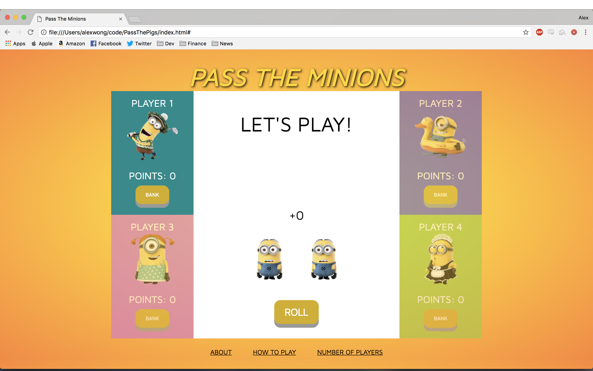

# Pass The Minions
Pass the Minions takes inspiration from Winning Moves Games' popular title Pass The Pigs. The object of the game is to be the first player to score 100 points using "Minions" as dice. I made this client-side game for my first project of General Assembly's Web Development Immersive program.

Play it here: https://alexw14.github.io/PassTheMinions/
## About
Pass the Minions is designed to be played with 2 to 4 players. Players roll both Minions and points are scored according to the position of the Minions. After rolling, the player can decide whether to stop rolling and "bank" the score, or to keep rolling to try and add points to the score. If the player rolls one Silly Minion and one Bored Minion, also known as Pass the Minions, the player loses all of the points accumulated in this turn and the turn ends. The first player to score 100 points wins the game.
## The Design
The project's user stories are documented and managed on Trello, which can be found here: https://trello.com/b/86Fp2pol/pass-the-minions

The game board is created with 3 divs. The first div is the left container (red) that holds Player 1, score, and bank. The second div is the main display (white) that holds the score this turn, dice 1 and dice 2, and the roll button. The third div is the right container (blue) that holds Player 2, score, and bank. The 3 divs are positioned using CSS flexbox layout. 

The Roll button and two Bank buttons are styled and event listeners using jquery are implemented for the roll function and the bank function. Two pig dice were used initially. The render function modifies and updates the content of the HTML and displays the corresponding score based on the positions of the dice.

The Minions theme is applied and the check winner function is implemented. Images of Minions are used and replace the pig dice. The opacity of the Player 1 box and the Player 2 box also changes in order to indicate the player's turn. The game logic is working and can be played with 2 players.

Styling using CSS is applied. Option for playing with up to four players is implemented. Keyboard controls are implemented which includes using spacebar to roll and the "B" key to bank. About the game, how to play the game, and option to change the number of players are added on the bottom of the page.

## Technologies Used
1. HTML
2. CSS
3. JavaScript and jQuery
## Next Steps
1. Implement an alternative game mode to allows users to choose a set number of turns to play. For example, if set to 5 turns, the player with the highest score at the end of the 5th turn is the winner.
2. Implement an option to allow users to set the max score.
3. Make the application mobile compatible.
